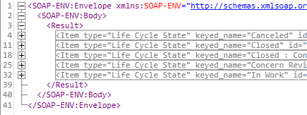
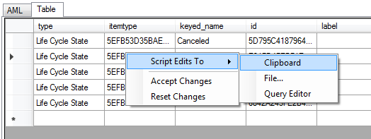
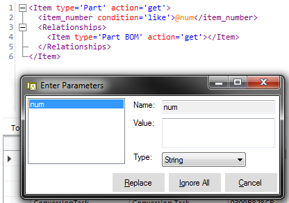
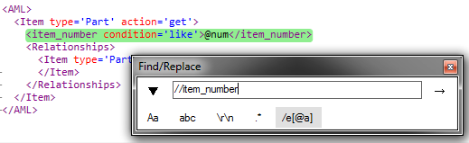
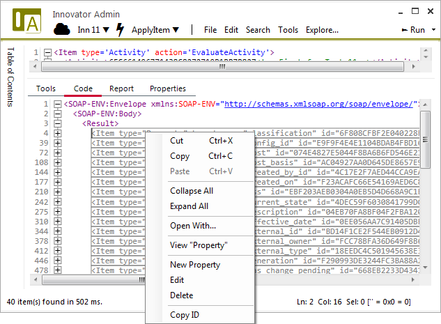
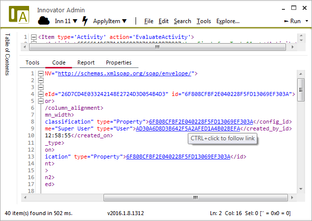
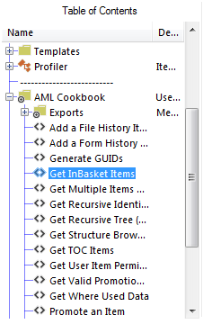

# AML Studio

An integrated version of [AML Studio](http://amlstudio.codeplex.com) 
powers all of the AML inputs and can be run separately from the main 
screen.

This version of AML Studio includes a number of improvments.  They include:

- Improved display of AML in the collapsed state
  
  

- Table display of AML that is editable and can be converted back to AML statements
  
  

- Support for parameterized queries leveraging the `@` symbol. Parameters can be 
  either the entiretly of a property or attribute or a portion of a SQL segment
  within a property or attribute

  

- Support for find/replace including a normal mode, extended mode (supports \r, \n, 
  etc.), Regex mode, and XPath mode.

  

- Many useful commands (e.g. viewing items, invoking actions, running reports, etc.) 
  can be invoked directly from the output editor's context menu
  
  
  
- Go directly to items referenced in AML by Ctrl+clicking on the links.
  
  
  
- Reference useful queries in the AML Cookbook folder of the Table of Contents
  
  
  
- The query currently under the cursor can be executed with `Ctrl+Enter`
- Auto-completion uses single quotes for easier inclusion in C# multi-line strings