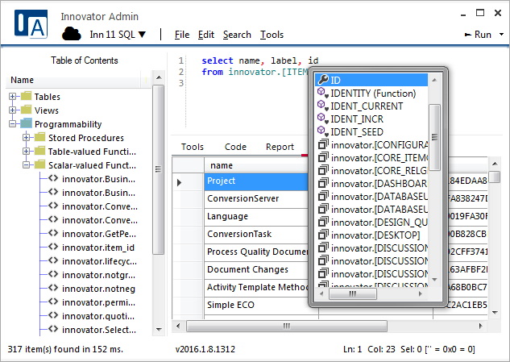

# A better admin tool

Innovator Admin is a Windows tool for querying and administrating databases. 
It is the ideal tool for administrating Aras Innovator PLM systems featuring 
an advanced AML query editor (with full intellisense) along with streamlined 
tools for exporting solutions from one database and importing them into 
another (e.g. during DEV to PROD migrations). It is also quickly becoming a 
great tool for querying SQL Server databases (with intellisense for SQL 
queries) among other data sources.

# What makes it better?

## ...[for querying](doc/aml-studio.md)

- Full Intellisense for AML and SQL provides helpful suggestions as you type
- Run just the query under your cursor with Run Current (or Ctrl+Enter)
- Parameter bindings: include @paramName parameters in your queries and give them values when the query runs
- (Innovator only) Editable grid which allows you to make changes and save them back to the database
- Excel-style block copy and paste in the grids
- (Innovator only) Smart AML code folding shows you just what you need to see
- (Innovator only) Renders HTML reports
- Continually being optimized for running large queries

## ...[for administering (Innovator only)](doc/innovator-installer.md)

- Imports and exports are streamlined into a single tool
- Anything can be exported regardless of the package used in the database
- Full dependency analysis performed on exports prevents you from forgetting anything
- Install into multiple databases simultaneously
- Useful progress indicators keep you informed of how your exports and imports are doing
- A helpful error dialog allows you to recover from install errors as they happen

# I want it

If you don't want to build the project from the source code, you can 
download the [latest release](https://github.com/erdomke/InnovatorAdmin/releases/latest) 
from GitHub. If you download and run the setup.exe installer file, 
the program should install and update automatically.

# Help me!

While there is some documentation built into the tool (e.g. the AML Cookbook 
folder of the Table of Contents when connected to an Innovator instance), 
additional documentation regarding the tool and Innovator can be found on the 
[wiki](https://github.com/erdomke/InnovatorAdmin/wiki).

# Let me help

All contributions are welcome. The range from shout-outs on social media to 
[bug fix](https://github.com/erdomke/InnovatorAdmin/issues) submissions and 
[feature requests](https://github.com/erdomke/InnovatorAdmin/issues) to 
even feature additions submitted via a pull request.