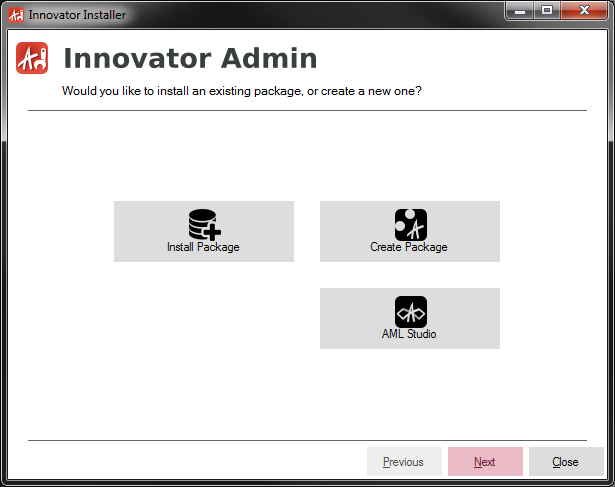
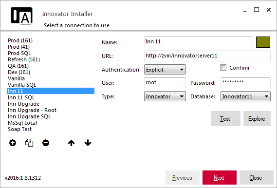
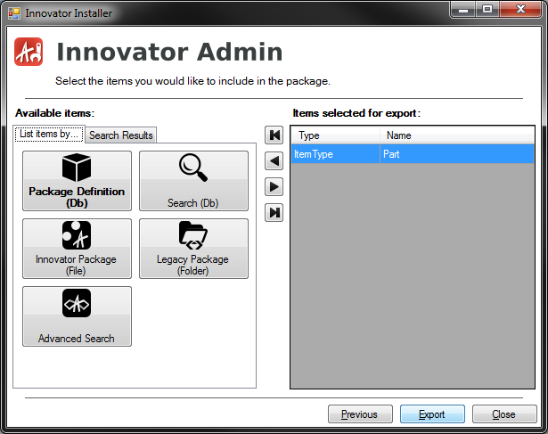
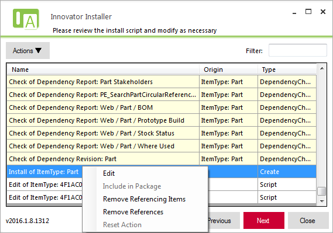
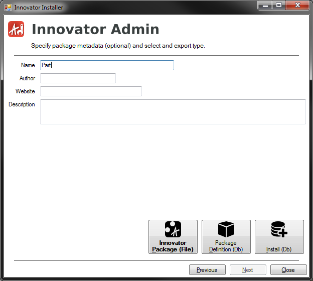
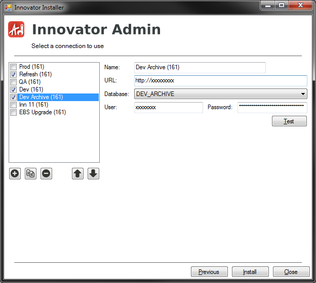
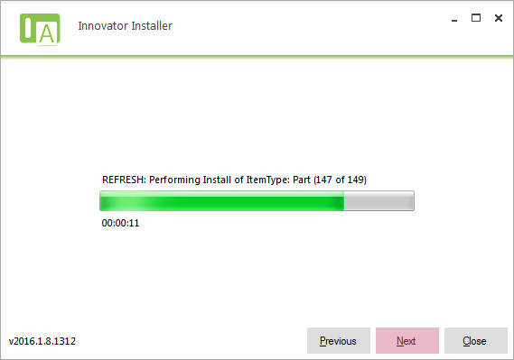
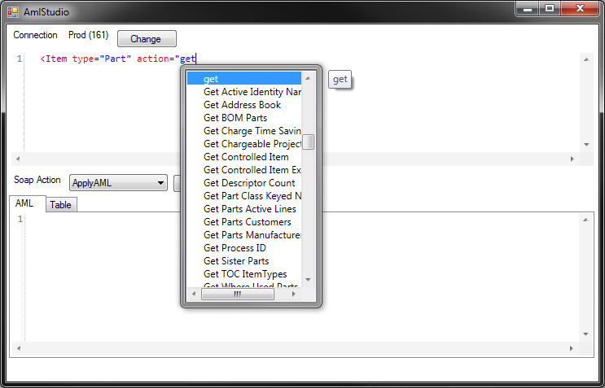

# Innovator Admin

Innovator Admin is a tool for managing Aras Innovator installations.  The 
initial focus of the tool is on installing and exporting packages.  While 
tools already exist for package installs and exports, this tool attempts 
to improve the experience in the following key areas:

## Wizard Interface

The new tool features a wizard interface to make it easier for 
non-developers to be able to quickly install packages.

## Connection Manager

A connection manager saves all your commonly used connections locally so
you don't have to repetitively enter URLs and credentials when running
multiple exports or installs

## Package Anything

No longer must all the items be in a pre-declared package in the database.
As you are creating your package, you can add items to it via a simple 
keyed_name search or through an advanced AML search. Previously saved
files can also be used as the basis for creating a package. This allows 
you to create packages which represent a unit of work as opposed to having
to create "canonical" packages and exporting pieces from multiple 
packages.

## Dependency Analysis

The tool will analyze the exported AML to find all dependencies. It will 
then prompt you for each dependency allowing you to alternatively include
that dependency in the package, remove the specific property reference,
or remove the entire Item with the reference.  This helps to ensure that 
you don't forget to include important items in the package.  In addition,
the tool will sort your package items in order of their dependencies to
help guarantee that they will import without any errors.

## Integration with Install

No longer are the export and install two entirely separate tools.  After
creating your package, you can save off the export files, immediately 
install the package into a target database, or both.

## Install in Multiple Databases at Once

If you want to quickly install the same changes in multiple databases,
simply check off all the databases you want to install the package in.
The installs will run back-to-back for each database instance.

## Clear Progress Indicator and Warning Dialog

A clear progress indicator tells you of the status of your install.  An
updated error dialog box will also give you a clear indication of any 
errors which may occur.  This dialog allows you to see the AML query
which caused the error and the SOAP error response.  It also gives you 
the option to either ignore the error, retry the query (e.g. after fixing
something in the database), or abort the entire install

## AML Studio Integration

An integrated version of [AML Studio](http://amlstudio.codeplex.com) 
powers all of the AML inputs and can be run separately from the main 
screen.

# Current Status

Please treat this tool as **alpha** level software.  While some of the 
core functionality has been tested and should work, other peripheral 
features have been blocked out and/or coded but not tested.  In 
particular, exports to/install from the previous manifest file and folder 
structure have not been tested.

# Ideas for Improvement

- Allow packages to install files on the web server (e.g. dlls, html 
  files, etc.).  Will also need to modify web files (e.g. 
  method_config.xml).
- Integrate with the Aras project site allowing the tool to become a 
  "NuGet" package manager for Aras projects
- Include an AML diff tool for easily seeing the differences in items
  between databases
- Allow for additional plugins so the tool can become a dashboard for
  administrative tools
- Include tools for 'uninstalling' packages or otherwise deleting items
- Include a tool for mass uploading files to the vault.

# Contributing

Feel free to fork the repo and submit pull requests with any changes you
would like to see made

# More Information

For more information, go to https://github.com/erdomke/innovatoradmin